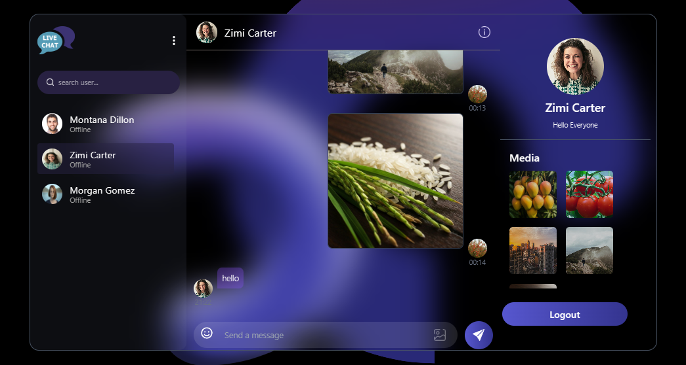
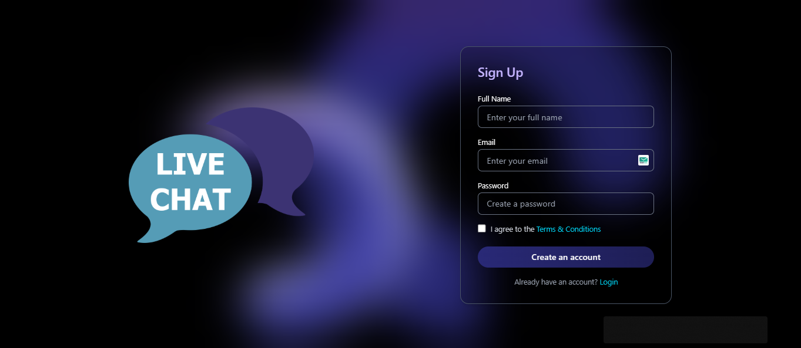
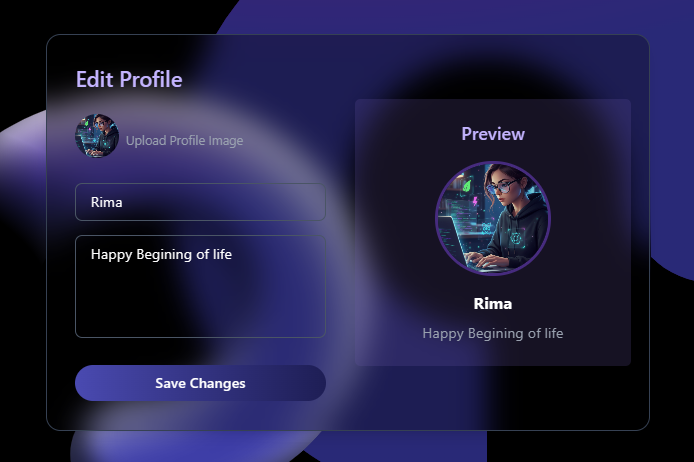

# Real-Time Chat App

A full-stack real-time chat application built with React, Next.js, Node.js, Express, MongoDB, and Socket.io.  
It includes real-time message delivery, seen status, image sharing, and dynamic unseen message counters.

## 🚀 Features

- ⚡ Real-time messaging using Socket.io
- 👁️ Message delivered & seen status
- 🔔 Unseen message counters for each user
- 🖼️ Image uploads using Cloudinary
- 🔐 Secure JWT authentication
- 📱 Fully responsive UI (Next.js + Tailwind)
- 📦 Scalable backend with modular API structure
- ☁️ Deployment-ready (Frontend & Backend on Vercel)

## 🛠️ Tech Stack

### **Frontend**

- React.js
- Tailwind CSS

### **Backend**

- Node.js
- Express.js

### **Database**

- MongoDB (Mongoose)

### **Realtime**

- Socket.io

### **Image Hosting**

- Cloudinary

### **Deployment**

- Vercel

## 🚀 Live Demo

🔗 **Frontend:** https://live-chat-fr.vercel.app  
🔗 **Backend API:** https://live-chat-backend-eight.vercel.app

## 📸 Screenshots

### 🗨️ Chat Interface

---

### 🔐 Authentication (Login / Signup)

---

### 📤 Image Upload inside Chat

